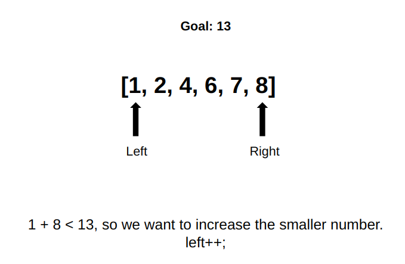
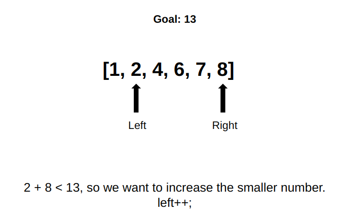
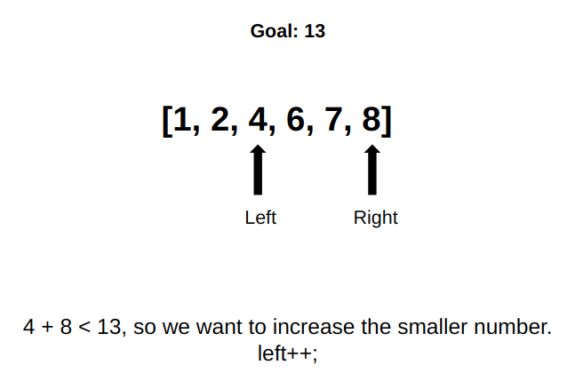
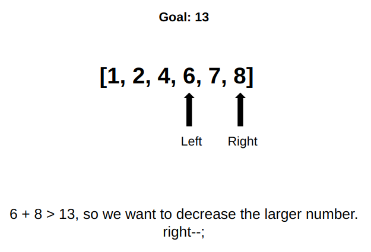
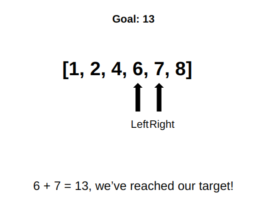

# Intro to CP Session 4 -- Sorting

## Table of Contents
 - [1. What](##1-what)  
 - [2.How](##2-how)  
 - [3. When](##3-when)  
 - [4. Examples](##4-examples)  
   + [Cetiri](###cetiri)  
   + [Basic Programming 2](###basic-programming-2)  
 - [5. Contest Problems](##5-contest-problems)  

## 1. What

Sorting: putting elements of an array in a specific order.

- [5, 3, 7, 1, 2] =====> [1, 2, 3, 5, 7]
- ['b', 'c', 'a'] =====>['a', 'b', 'c']


## 2. How

There are many different sorting algorithms.

- bubble sort, insertion sort, merge sort, quick sort, heap sort, etc.
- C++ uses a hybrid sorting algorithm called [introsort](https://en.wikipedia.org/wiki/Introsort).
- Professor Smallberg doesn't talk about this, but by far the best sorting algorithm is [bogosort](https://en.wikipedia.org/wiki/Bogosort).
- It is important for everyone to know a little bit about sorting. [Here's why](https://www.youtube.com/watch?v=k4RRi_ntQc8).


Despite the importance, the detailed discussion about these sorting algorithms will be omitted in this document, as the sorting algorithms are taught in class. 

Being able to use a sorting algorithm, on the other hand, is crucial to today's discussion. Here's how you would sort an array in C++. The implementation of this function is very fast (probably faster than your implementation), so in a contest, when you need to sort an array, just use ``sort()``.

```c++
#include <algorithm>			// included inside <bits/stdc++.h>
int main() {
	int arr[5] = {10, 8, 6, 4, 2};
	sort(arr, arr+5);			// sort the elements between arr[0] and arr[4]
	cout << arr[4] << endl;		// this prints out 10
}
```

To sort a vector, do this

```c++
sort(vec.begin(), vec.end());
```

To sort in descending order, do this

```c++
sort(arr, arr+n, greater<TypeName>());  // TypeName -> int, string, etc.
```

To sort in a custom order, do this

```c++
bool myComparison(int a, int b) {
    // return true / false
}

// later in the program
sort(arr, arr+n, myComparison);
```


## 3. When 

**When**:

- When the problem is about sorting (obvious).

- When the data has an intrinsic order (numbers, strings, etc.).

- When the current order of the array doesn't matter. (``sort()`` sorts in place, so using this function would trash the original order).

- When having the elements of the array in order would make later tasks easier.

- Some algorithms have the precondition that the input has to be sorted first. e.g. binary search (next week's topic).

  

## 4. Examples

### Cetiri

>  https://open.kattis.com/problems/cetiri

- Brute force is too tedious.
- Sorting makes the problem a lot easier to code. In competitive programming, finding the fastest answer isn't always the goal. Find the fastest algorithm to code that passes the tests is often a better goal.
- [Here's the answer](./answers/cetiri.cpp).

### Basic Programming 2

> https://open.kattis.com/problems/basicprogramming2

1. Sort -> two pointer technique.

   <div style="display: flex; flex-direction: row; overflow: scroll;"></div>

   This problem actually has a faster solution that doesn't require sorting. Read about [hash table](https://en.wikipedia.org/wiki/Hash_table) and C++'s implementation of it [unordered_set](http://www.cplusplus.com/reference/unordered_set/unordered_set/) to see if you can figure it out.

2. Sort -> compare the neighbors.

3. Sort -> count adjacent duplicates.
4. Sort -> find the median.
5. Sort -> iterate through with an if statement.

- [Here's the answer](./answers/basicprogramming2.cpp).


## 5. Contest Problems

> Coming Soon!

